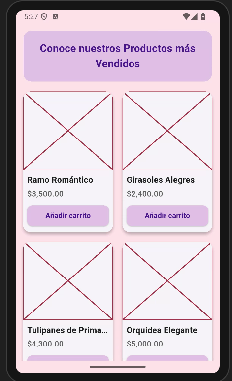
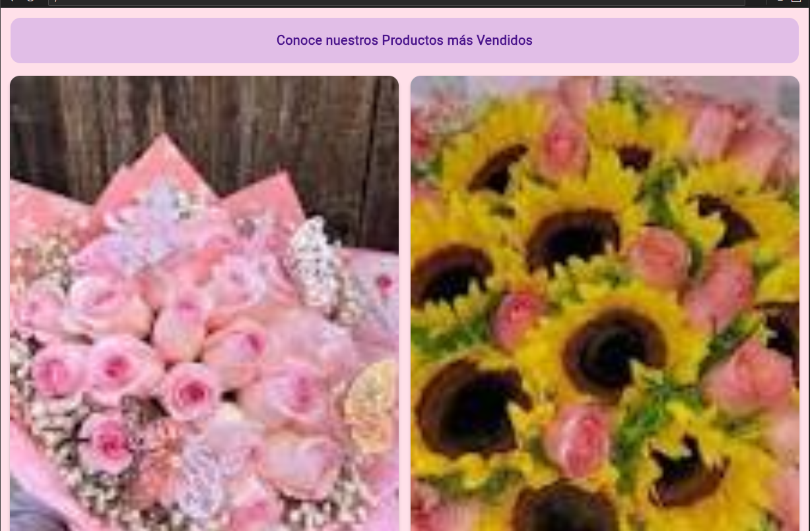

# myapp

lenguaje dartd flutter, nivel principiante , de fondo color rosita ,un recctangulo en parte supeir arriba y dentro de el un texto "Conoce nuestros Productos mas Vendidos" el color de fondo del rectangulo es color morado claro , abajo cuatro cuadrados con imagenes de la erd y el nombre de los ramos de flores ,el precio $ ,y abajo de cada uno un rectangulo dentro de el el "añadir carrito"